# PiElectrical

This is the working repo for PiElectrical teams

1. [ToDo](#todo)
2. [Repo Structure](#repo-structure)
3. [Setup](#setup)
4. [Work Flow](#work-flow)
5. [How to Create a Gerber](#how-to-create-a-gerber)
6. [Docu Packets](#docu-packets)
7. [FAQ](#faq)
8. [Useful Links](#useful-links)
9. [Standards](#standards)

## ToDo:
* The stuff in PDB-Y16
* Convert motor controller design to KiCad
* Add and test current regulation for motor controller
* Talk to runtime and potentially use cheaper MCU for motor controller

[Back to Top](#pielectrical)

## Repo Structure:

**Boards**: Contains all necessary information about each board, including KiCad (and old Eagle) files, arduino test files, and board specific documentation.

**Bootloaders**: Contains the files necessary to burn the bootloader for boards identifying as Leonardo (Atmega32u4).

**Documentation**: All docu packets and scripts. *Fragile! Do not touch!*

**Production_Files**: Finalized gerbs and other necessary production files (BOM, CPL, etc...) sent out for fabrication.

**Images**: Place all your images in here to enhance your READMEs.

**Libraries**: Necessary KiCad files to work on PiElectrical


ToDo is on the README to keep things easier to see at first glance. GitHub issues tracker can be used as well.

[Back to Top](#pielectrical)

## Setup

<details>
    <summary>When you see an arrow like this... (click me)</summary>
        ...it indicates an expandable section. We usually include images in here as a better reference for you to follow along.
</details>

### Initial Setup of PiElectrical repo on your computer

1. Copy the URL for pioneers/PiElectrical to your clipboard: (Or here: https://github.com/pioneers/PiElectrical.git)
2. In Terminal (Mac, GNU/Linux) or Git Bash (windows), navigate to your working directory (the directory that you want to keep PiElectrical in.)
3. Clone PiElectrical by running this command: `git clone https://github.com/pioneers/PiElectrical.git`

### Installation of KiCad on your computer
1. Download the latest version of KiCad here: https://www.kicad.org/download/
2. <details>
    <summary>Run installer. Use all default settings on installer. (Click to see default settings)<br></summary>
    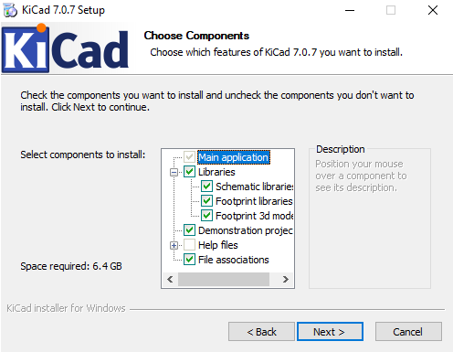
</details>

### Setting up KiCad
1. Open KiCad.
2. <details>
    <summary>Depending on whether you've used KiCad before, select the appropriate option on the pop-up. (Default settings if you're new to KiCad).</summary>
    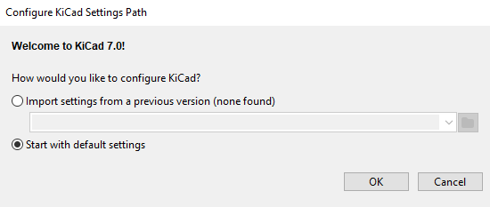
   </details>

#### Adding Symbols
1. <details>
    <summary>Go to the <i>Preferences</i> tab, and select <i>Manage Symbol Libraries...</i></summary>
    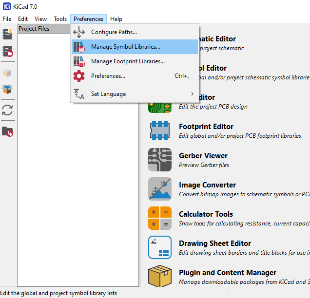
   </details>
2. <details>
    <summary>If this is your first time using KiCad, it will prompt you to configure the <i>Global Symbol Library</i>. It is highly recommended that you select "Copy default global symbol library table".</summary>
    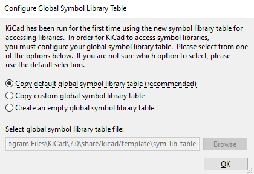
   </details>
3. <details>
    <summary>Select the folder icon near the bottom left and navigate to the <i>PiE_Symbols.kicad_sym</i> file in the <i>src</i> folder.</summary>
    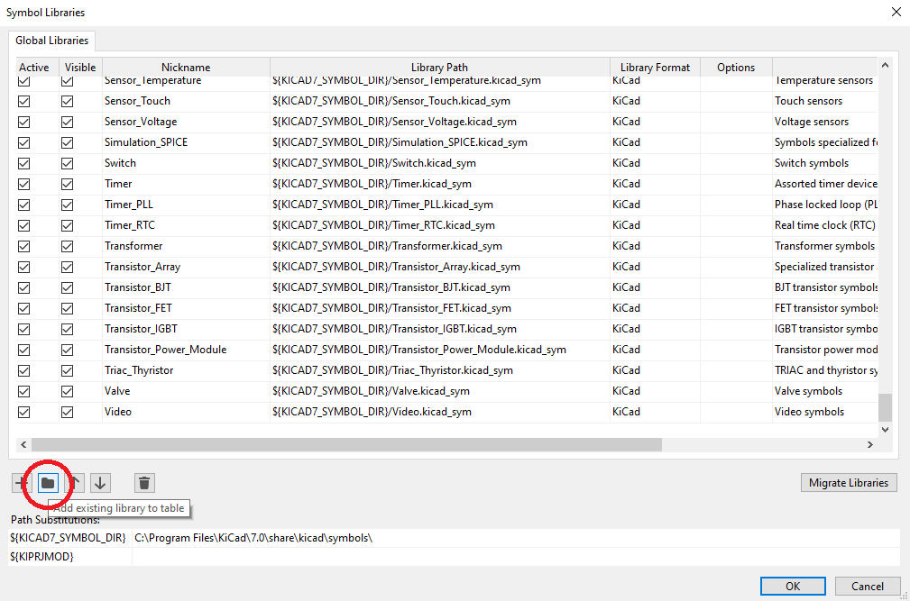
   </details>
4. <details>
    <summary>You should now see the <i>PiE_Symbols</i> in your Symbol Libraries. Make sure the "active" box is checked, and click "OK".</summary>
    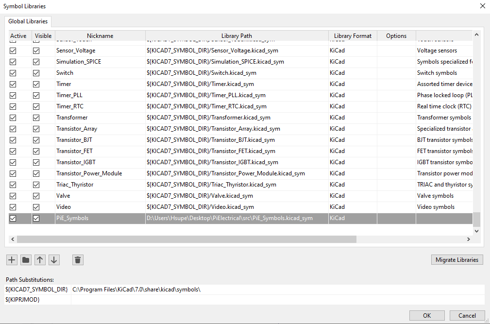
   </details>

#### Adding Footprints
1. <details>
    <summary>Go to the <i>Preferences</i> tab, and select <i>Manage Footprint Libraries...</i></summary>
    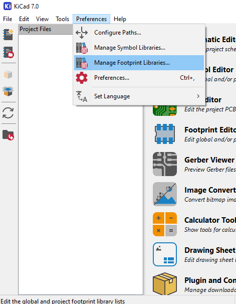
   </details>
2. <details>
    <summary>If this is your first time using KiCad, it will prompt you to configure the <i>Global Footprint Library</i>. It is highly recommended that you select "Copy default global footprint library table".</summary>
    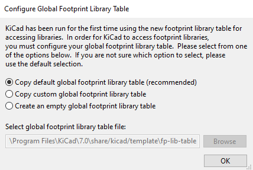
   </details>
3. <details>
    <summary>Select the folder icon near the bottom left and navigate to the <i>PiE_Footprints.pretty</i> file in the <i>src</i> folder.</summary>
    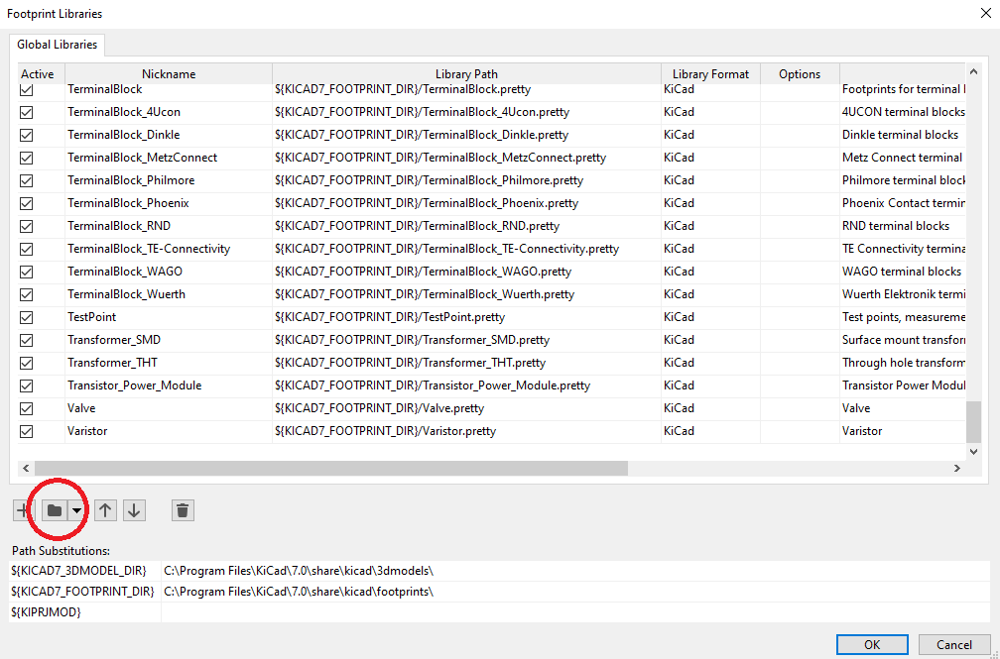
   </details>
4. <details>
    <summary>You should now see the <i>PiE_Footprints</i> in your Footprint Libraries. Make sure the "active" box is checked, and click "OK".</summary>
    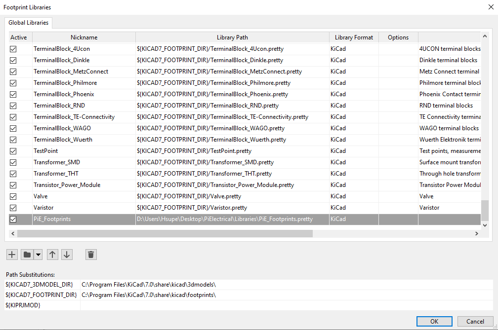
   </details>

Note that this setup instruction is based on KiCad 7.0.7, but it should still work for other versions.

[Back to Top](#pielectrical)

## Work Flow

Protocol when working on KiCad files

The revision number should be *REV \<year\>\<revision\>*. E.g. **REV 16A** for year 16 revision A.

If you are not quite familiar with git, see [Useful Links](#useful-links) for the PiE Github tutorial

**WARNING**: Do not modify PiE_Symbols.kicad_sym or PiE_Footprints.pretty without discussing it with PMs.

### Steps when working on KiCad files:

1. In Terminal (mac, GNU/Linux) or GitBash (windows), navigate to your working directory (wherever you have PiElectrical).
2. Make sure your working directory is clean: git status
3. If you haven't started your sub project: git checkout -b YOURNAME-SUBPROJECT
  3. YOUR\_NAME/SUBPROJECT is now the name of your branch
4. Do your work in KiCad.
5. Once you are at a good stopping point in your KiCad work, commit your progress:
    1. git add path/to/your/file
    2. git commit -m "Make your commit message short and with this format"
    3. **NOTE**: Commiting is like saving your file, but for all of PiE as well as your personal computer. And just like saving, Commit Early & Commit Often!
6. Repeat Steps 5 and 6 until you are finished with your EAGLE work.
7. Once you have made your last commit, push your files to the PiElectrical github repo: git push origin YOUR\_BRANCH
    - If you get a merge conflict, contact the PMs for help.
8. If **completely** done, submit a Pull Request

### Commit Message Format Conventions

* Present Tense ("Reroute power traces on team flag", not "Rerouted power traces on team flag")
* No period at the end: ("Reroute power traces on team flag", not "Reroute power traces on team flag.")
* Keep your message length to about one sentence.

### Merge Conflicts: What should I do?

Don't try to fix it yourself: Eagle files are finicky and you might break all your work!

Ask someone who knows how to deal with this, i.e. your PM or something

[Back to Top](#pielectrical)

## Generating Fabrication Outputs

1. Make sure you run the Electrical Rules Check (ERC) in the schematic and the Design Rules Checker (DRC) in the layout, and have no *red* errors. Feel free to ask PMs if you have any questions.
2. <details>
    <summary>Go to File -> Fabrication Outputs -> Gerbers (.gbr)...</summary>
    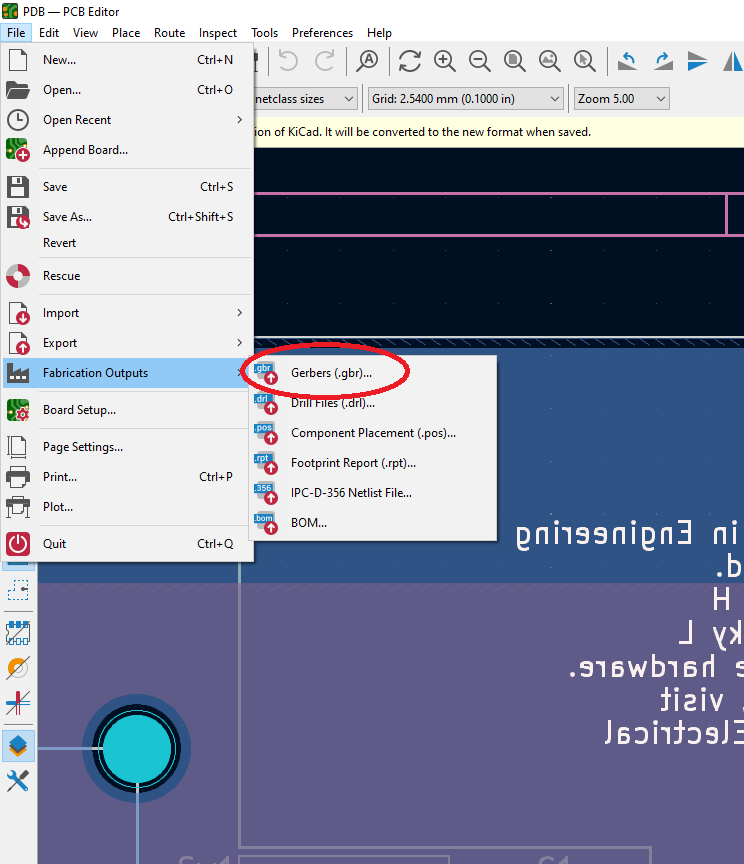
   </details>
3. <details>
    <summary>If this is your first time using KiCad, it will prompt you to configure the <i>Global Symbol Library</i>. It is highly recommended that you select "Copy default global symbol library table".</summary>
    
   </details>
4. <details>
    <summary>Select the folder icon near the bottom left and navigate to the <i>PiE_Symbols.kicad_sym</i> file in the <i>src</i> folder.</summary>
    
   </details>
5. <details>
    <summary>You should now see the <i>PiE_Symbols</i> in your Symbol Libraries. Make sure the "active" box is checked, and click "OK".</summary>
    
   </details>

1. Open the brd file
2. Click Cam Job
3. Open pie.cam
4. Make a directory in each sensor's folder called SENSOR\_NAME-gerb
    * SENSOR\_NAME **must** be the exact name as the brd file
5. Run job, and click yes to all for the polygon issue
6. Once all the jobs are done, run `make gerb`

[Back to Top](#pielectrical)


## FAQ

Q: What's the difference between commit before I pull?

A: Do you want to keep any of the changes? Then commit those (the ones you want to keep) before you pull. Or else, the things you pull might conflict with your work, and you'll have a git disaster.

Q: I worked on my stuff, pulled, and everything I did went away!

A: As long as you committed, the PMs can recover your work for you.

Q: Why am I working on my own branch?

A: This is to keep track of pull request and board reviews on a per board basis

[Back to Top](#pielectrical)

## Useful Links

PiE's own [Github Tutorial](https://docs.google.com/a/pioneers.berkeley.edu/presentation/d/1ef5zSDMbE7dCu4XAC4dXhSV5iUd7gjCyXPjRrRvtbQI/edit?usp=sharing)

[PiElectrical Wiki](https://github.com/pioneers/PiElectrical/wiki)

[Markdown Cheatsheet](https://github.com/adam-p/markdown-here/wiki/Markdown-Cheatsheet)

[Arduino Pro Micro Pinouts](https://cdn.sparkfun.com/assets/9/c/3/c/4/523a1765757b7f5c6e8b4567.png)

[BAC DFM](http://instantdfm.bayareacircuits.com/)

Read up on the [PiE Electrical Style Rules and Guidelines](https://staff.pierobotics.org/wiki/Electrical_style_guidelines) (This is a good resource, but outdated)

[Back to Top](#pielectrical)

## Design Rules

You can find JLC's design rules here: https://jlcpcb.com/capabilities/pcb-capabilities. Please review this before ordering a PCB.

#### Some of our general rules:
- Traces **must** be multiples of 45 degrees
- Standard Pin Distance: 100 mils (2.54 mm)

#### Make sure to annotate your boards:

```
Copyright (c) 2023, Pioneers in Engineering
All rights reserved.

Design by: Justin H
This design is open source hardware.
For more information, visit 
github.com/pioneers/PiElectrical
```

[Back to Top](#pielectrical)

