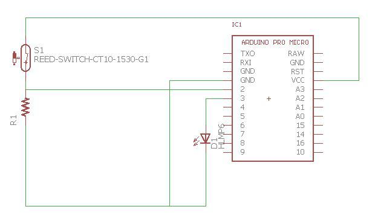

#TwistIt

Screw terminal based potentiometer/line follower/limit switch ultimate board

Named TwistIt for the screw terminal (open to suggestions)

Digital in Pins are all labeled "Arduino" in the pinout diagram

Analog pins are labeled as such

Analog pins can be used as digital, NOT vice versa

[2 Pin](https://www.sparkfun.com/products/8432) [3 pin](https://www.sparkfun.com/products/8433)

##Reed switches

Basically when it is placed in a magnetic field, the switch closes.

There surface mounts and through hole variants, but generally they have the same working range

For more specs, please view the link below:

http://www.digikey.com/product-search/en/switches/magnetic-reed-switches/1114199

It can be bought from Digikey, Sparkfun, Aliexpress, Amazon.

[AliExpress](https://www.aliexpress.com/item/10pcs-KSK-1A-Reed-Switch-2x14mm-Green-Glass-Usually-Open-For-Sensors-100-Original/32424207994.html)

To test it, connect it in series with a resistor and take the input from the point between them.

A sample of a simple code is shown below:

```
int reed = 2;

int LED = 3;

void setup() {

Serial.begin(9600);

pinMode(reed,INPUT);

pinMode(LED,OUTPUT);

}

void loop() {

if(digitalRead(reed)==HIGH){

digitalWrite(LED, HIGH);

}

else digitalWrite(3, LOW);

}
```
where an LED is attached to pin 3.



Please contact Ren Lingfei for more information.

## Yogi Bear Break Out

VNH2SP30 | APM
-------- | ---
5V | Vcc
GND | GND
EN | 14
INA | 16
INB | 10
CS | 8
PMW | 9

Red = 2
Yellow = 3
Green = 4
